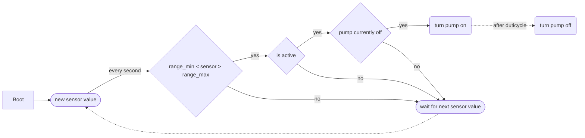
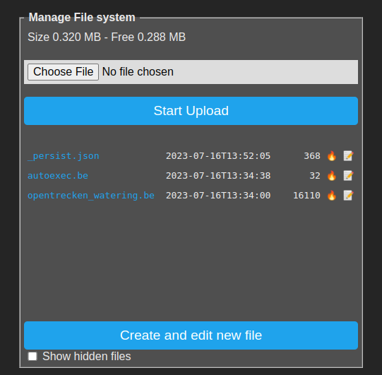
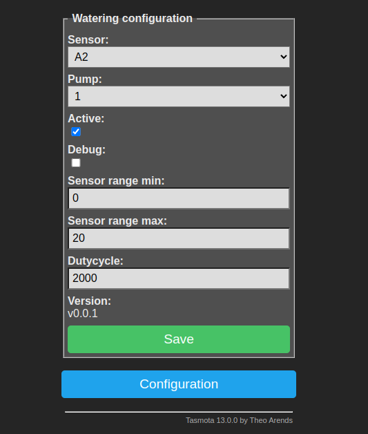

# Opentrecken Watering

This driver extension is designed to automate the watering of a plant.

For this purpose the value of a moisture sensor is read out continuously about every second.
If the moisture sensor delivers a measured value within a configurable range, a water pump connected to an output is switched on for a configurable period of time.



## Install

Go to `Consoles` -> `Manage File system` at the webinterface of the device.

Create a file named `autoexec.be` in the device. The file should contain the following content:

``` be
load("opentrecken_watering.be")
```

The instructs the device to automatically run the watering module at system startup.

Upload the file `opentrecken_watering.be` to the same folder of the device.



The file `_persist.json` will be created by the device itself later on and will contain the current settings.

After a reboot of the device the UI is avaiable in the menu `Configuration` -> `Configuration Watering`.

## Settings



With these settings, the pump connected to relay 1 is switched on approximately every second for 2 seconds each time the humidity sensor connected to input A2 delivers a value between 0 and 20.

### Active

This allows the entire pump control to be disabled or enabled.

If it is not activated, the pump is never switched. Regardless of what value the sensor delivers.
The pump is only switched if this is set to true.

### Sensor

This selects the input from which the current moisture value of the sensor is read from. 
The menu should contain all analog Inputs `ADC xxx` configured on the device.

### Pump

This selects the output where the pump is attached to.
The menu should contain all `Relay`s reconfigured on the device.

### Sensor Range

The two values min and max define the range in which the sensor value must be in order to switch on the pump. 
The raw values supplied by the sensor must be specified here.

### Dutycycle

Defines the time in milliseconds that the pump should remain switched on per interval.
